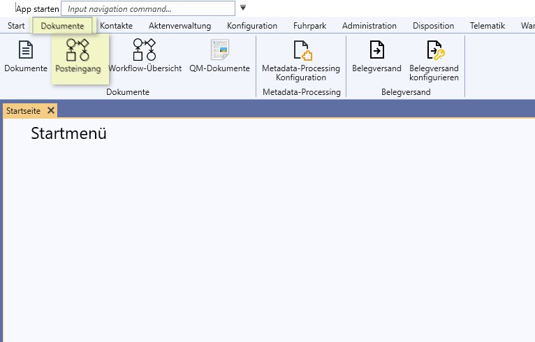
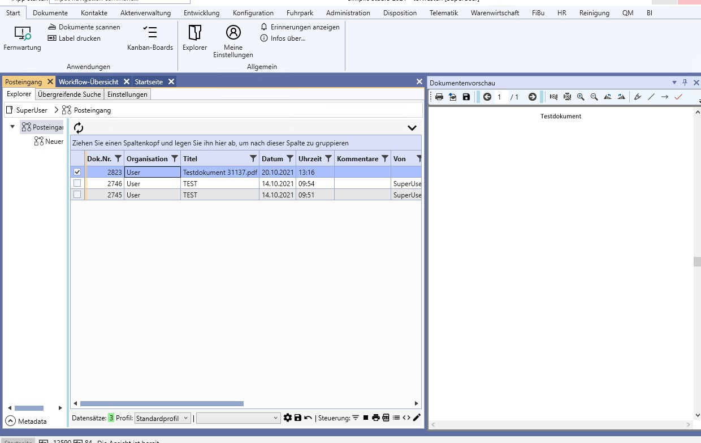
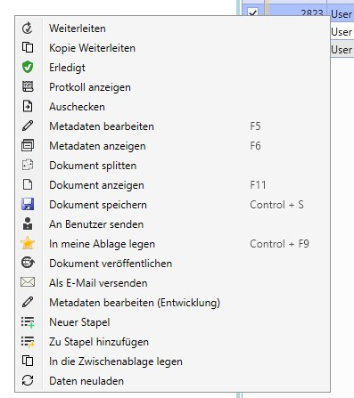
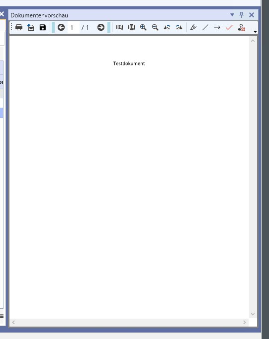
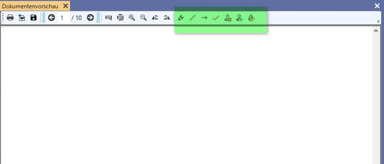
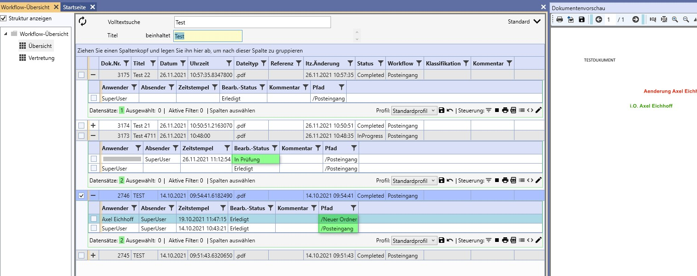

# Posteingang nutzen

## Definition Posteingang

Der Posteingang bildet den Dokumenteneingang in das Unternehmen ab.
Dokumente werden an einer oder mehreren zentralen Stellen eintreffen und dort automatisch oder manuell an die Empfänger oder Abteilungen verteilt.
Der automatische Eingang wird im SIMPLIC durch den Support eingerichtet. 
Er umfasst die gängigen Kommunikationswege:

1. Papiereingang --> Scannen in einen Ordner oder in das SIMPLIC
2. Maileingang --> Ablage in ein Importverzeichnis oder per Drag & Drop
3. Download via FTP/SFTP

Für die Arbeit mit dem Posteingang sind im Standard die Bereiche Posteingang und Workflow-Übersicht eingerichtet.
Posteingang ist das eigene Postfach, vergleichbar mit dem Outlook Mailpostfach.
Die Workflow-Übersicht hilft bei der Nachverfolgung der Belege.

## Posteingang bearbeiten

Der Posteingang ist unter dem Reiter Dokumente / Posteingang zu finden.

Es öffnet sich die eigentliche Oberfläche.
Wir sehen hier drei Tabs 

| Tab | Bedeutung |
| --- | --- |
| Explorer | Zum bearbeiten des Posteingangs mit dem Ordnerbereich und dem Dokumentenbereich. |
| Übergreifende Suche | Zur Recherche im klassischen Tabellenformat. Es werden nur Dokumente angezeigt, für die Berechtigungen erteilt sind.|
| Einstellungen | Für Einstellungen |

---

### Tab Explorer Ordnerbereich

Der Ordnerbereich ähnelt der Baumstruktur im Outlook.
Hier können entweder Dokumentenworkflows hinzugefügt und verknüpft werden oder eine Ordnerstruktur nach eigenem Organisationsschema hinterlegt und betitelt werden.

Wichtig bei Workflows ist, dass diesen auch ein entsprechender Workflow zugewiesen ist. 

Die reinen Ordner dienen lediglich als Ablagestruktur und haben keine Posteigenschaften.

Mit der rechten Maustaste haben Sie im Menü folgende Auswahl
- sonstiges
- Ordner löschen
- Metadaten bearbeiten
- Ordner umbenennen
- Aus Zwischenablage einfügen
- Scannen und archivieren
- Workflow zuweisen

#### sonstiges
Auswahl einen neuen Ordner oder einen neuen Workflow anzulegen

#### Ordner löschen / umbenennen
Hier kann die Ordnerstruktur bearbeitet werden.

#### Aus Zwischenablege einfügen
Haben Sie ein Dokument in der Zwischenablage gespeichert, kann es hier eingefügt werden.
Es öffnet sich das Metadatenfenster für Dokumente.

#### Scannen und archivieren
Hier haben Sie die Möglichkeit bei installiertem Scanner direkt in den Ordner Dokumente einzuscannen. Es öffnet sich das Scanfenster von SIMPLIC.

#### Weitere Option
Sie können auch ein Dokument per "Drag and Drop" in den entsprechenden Ordner ziehen und es so archivieren.

---

### Tab Explorer Dokumentenbereich
Im Dokumentenbereich werden alle Dokumente angezeigt, welchen in Ihrem Posteingang liegen.
Zum Aktualisieren sollten Sie das Aktualisierungssymbol anklicken.

Im Standard sind folgende Spalten von Interesse:

- Organisation ( User oder Organisationseinheit )
- Titel
- Datum und Uhrzeit
- Kommentar zu dem Dokument
- Von ( Wo kommt das Dokument her )

Rechts neben dem Posteingang sollte sich, so Sie einen Posteingang auswählen, das entsprechende Dokument in der Vorschau öffnen.
TIP: Diese Vorschau können Sie auch auf einen andere Bildschirm verschieben.

Mit der rechten Maustaste kann nach der Auswahl eines Dokumentes folgende Aktionen durchgeführt werden:

| Taste | Aktion|
| --- | ---|
| Weiterleiten | Es öffnet sich ein Auswahlfenster. Das Dokument kann hier an einen anderen Benutzer oder eine Gruppe weitergeleitet werden. Gleichzeitig wird der Status 'Erledigt' gesetzt und es verschwindet aus dem eigenen Posteingang. |
| Kopie Weiterleiten | Eine Kopie wird weitergeleitet. Das Dokument bleibt im Posteingang erhalten. |
| Erledigt | Den Posteingang Workflow auf erledigt setzen. |
| Protokoll anzeigen | Ein Fenster mit deR Bearbeitungshistorie zu diesem Dokument öffnet sich.  |
| Ausschecken |  |
| Metadaten bearbeiten (F5) | Maske zur Bearbeitung der Metadaten wie Titel, Referenz, Klassifikation und Kontaktverknüpfung etc. |
| Metadaten anzeigen (F6) | wie Bearbeiten nur ohne Speicherfunktion. |
| Dokument splitten | Hier kann ein mehrseitiges Dokument in aufgesplittet werden.  |
| Dokument anzeigen (F11) | Das Dokument wird im externen Programm angezeigt. |
| Dokument speichern (Ctrl+S) | Der Speicherdialog öffnet sich. |
| An Benutzer senden | Hiermit kann das Dokument an einen anderen Benutzer in dessen Ablage (Nicht Posteingang) gelegt werden. Das Ablagesystem ist ein anderer Bereich von SIMPLIC. Es wird hierdurch nicht aus dem Posteingang entfernt! |
| In meine Ablage legen (Ctrl+F9) | Dto. Nur wird das Dokument in die eigene Ablage gelegt. |
| Dokument veröffentlichen | --- |
| Als E-Mail versenden | Es öffnet sich ihr Mailprogramm mit einer neuen, leeren Mail mit dem Dokument im Anhang und dem Dokumententitel im Betreff. |
| Neuer Stapel | Die Stapelfunktion wird ausgeführt. Ein neuer Stapel wird gebildet. |
| Zu Stapel hinzufügen | Dieses Dokument kann einem Stapel hinzugefügt werden. |
| In Zwischenablage legen | Administrationsfunktionalität |
| Daten neu laden | Die Daten werden neu geladen |

Diese Tabellenansicht kann wie gewohnt gruppiert, gefiltert und durchsucht werden. Auch andere Profile können hinterlegt werden.
Die meisten der ausführbaren Aktionen können auch hier für mehrere Dokumente gleichzeitig durchgeführt werden indem diese entsprechend markiert werden.

### Die Dokumentenvorschau
Diese Funktionalität findet sich auch in der Dokumentenverwaltung.
Sie kann auf alle Dokumente angewendet werden, welche einen sichtbaren Inhalt haben, wie PDF, Excel, Word oder Textdateien.

Durch Auswahl eines Dokumentes öffnet sich am rechten Bildschirmrand die Vorschau des Dokumentes.
Diese Vorschau kann auch auf einen anderen Bildschirmverschoben und in der Größe angepasst werden.

Je nach Dokumenttyp, welcher in der Vorschau ausgewählt ist,
wird am Oberen Rand das Menu der Vorschau mit Standardfunktionen wie blättern, zoomen, drehen, speichern etc. angezeigt.
Bei anderen Dateitypen fehlt dieses.

Für PDF werden außerdem weitere Funktionen angezeigt.

| Symbol | Bedeutung |
| --- | --- |
| Stift | Markierung in Gelb als "Textmarker" |
| Linie | Eine Linie wird eingefügt. Obacht: Doppelklick beendet die Eingabe!  |
| Pfeil | Ein Pfeil kann eingefügt werden |
| Haken | Symbol zum Abzeichnen |
| Stempel rot | Ein roter Stempeltext "Änderung notwendig" mit Benutzernamen und Editierfunktion| 
| Stempel grün | Ein grüner Stempeltext "i.O." mit Benutzernamen und Editierfunktion" | 
| Symbol orange | Button zum Festschreiben der Änderung | 

Zur Verwendung hier eine Animation:

### Die Stapelfunktion
Diese Funktionalität findet sich auch in der Dokumentenverwaltung.

Durch die Stapelverarbeitung lassen sich mehrere Dokumente zu einem neuen Dokument oder zu einer neuen Version zusammenfassen.
Hierzu wird zuerst das erste Dokument ausgewählt und im Menu die Funktion Neuer Stapel ausgewählt.
Es öffnet sich ein kleines Fenster, in dem der neue Stapel angezeigt wird. Der Name kann hier auch geändert werden. 
Sollten Sie bereits mehrere Stapel erzeugt haben, werden sie in Tabs angezeigt.

Bei geöffnetem Fenster, wird ein weiters Dokument - egal ob im Posteingang oder in der Dokumentenverwaltung - mit dem Menue Eintrag "Zum Stapel hinzufügen" hinzugefügt.

Innerhalb des Stapels kann die Reihenfolge der Dokumente durch verschieben geändert werden.

Abschließend kann ein neues Dokument erzeugt werden.
Alternativ kann eine neue Version des Dokumentes erzeugt werden, welches vorher markiert wurde.

Hierzu eine kleine Animation:

## Workflow Übersicht

Diese Übersicht unter Dokumente / Workflow-Übersicht zeigt den Status der einzelnen Dokumente im Posteingang an.
Ist hier das entsprechende Dokument ermittelt, kann durch herunterklappen auf dem + die Historie des Dokumentes ermittelt werden. Angezeigt wird der Status und der Mitarbeiter / die Gruppe bei dem dieses Dokument wann in Bearbeitung ist bzw. war.
Auch der Ablageort des Dokumentes im Posteingang wird angezeigt.

Eine Bearbeitung der Daten an dieser Stelle ist nicht möglich.
Die Anzeige dient einzig der Recherche.

