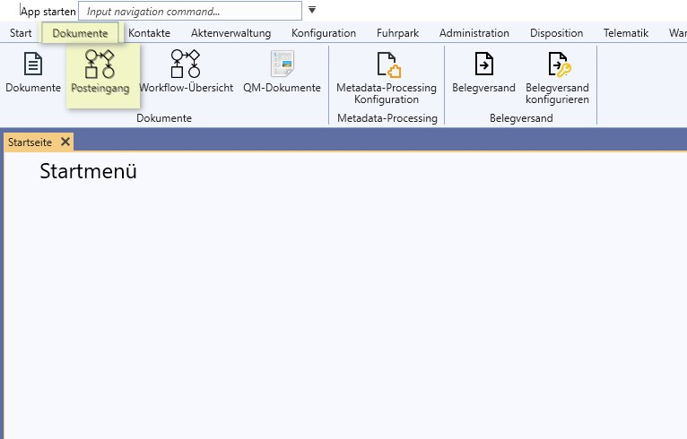
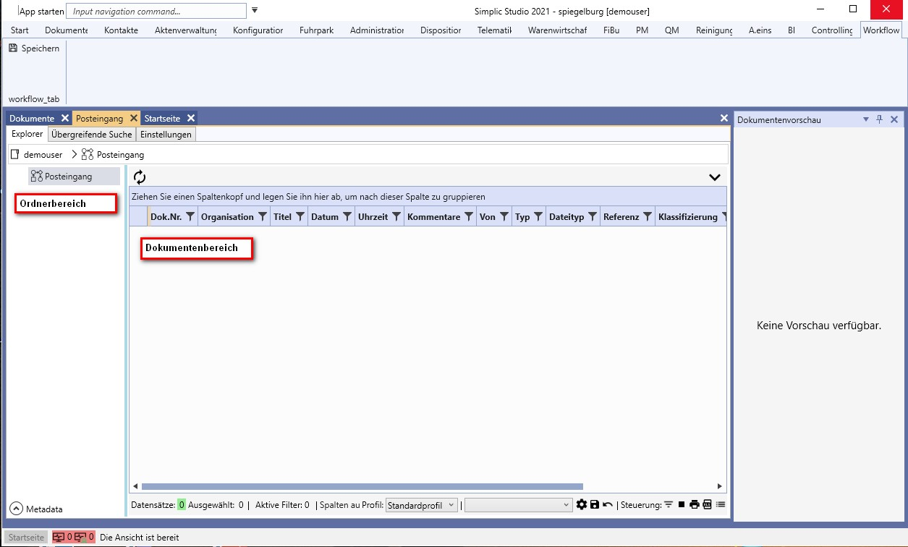
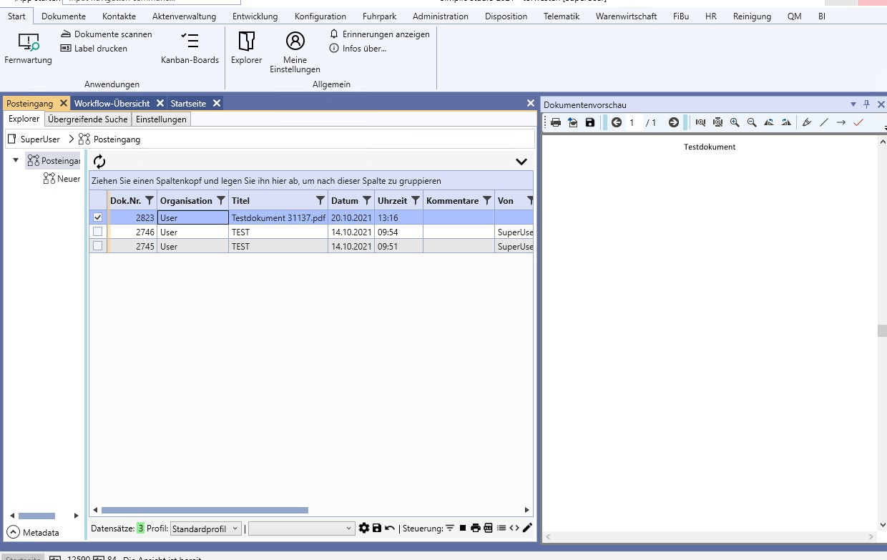
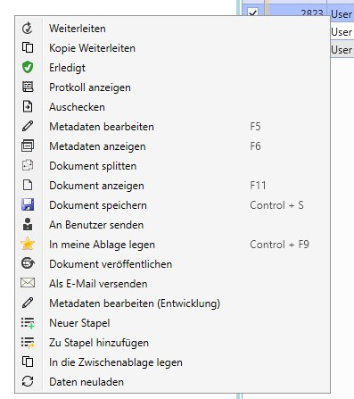

# Posteingang nutzen

## Definition Posteingang

Der Posteingang bildet den Dokumenteneingang in das Unternehmen ab.
Dokumente werden an einer oder mehreren zentralen Stellen eintreffen und dort automatisch oder manuell an die Empfänger oder Abteilungen verteilt.
Der automatische Eingang wird im SIMPLIC durch den Support eingerichtet. 
Er umfasst die gängigen Kommunikationswege:

1. Papiereingang --> Scannen in einen Ordner oder in das SIMPLIC
2. Maileingang --> Ablage in ein Importverzeichnis oder per Drag & Drop
3. Download via FTP/SFTP

Für die Arbeit mit dem Posteingang sind im Standard die Bereiche Posteingang und Workflow-Übersicht eingerichtet.
Posteingang ist das eigene Postfach, vergleichbar mot dem Outlook Mailpostfach.
Die Workflow-Übersicht hilft bei der Nachverfolgung der Belege.

## Posteingang bearbeiten

Der Posteingang ist unter dem Reiter Dokumente / Posteingang zu finden.

Es öffnet sich die eigentliche Oberfläche
Dieser ist geglieder in den linken Ordnerbereich und den rechten Dokumentenbereich.

---

### Ordnerbereich

Im Ordnerbereich können entweder Dokumentenworkflows hinzugefügt und verknüpft werden oder eine Ordnerstruktur nach eigenem Organisationsschema hinterlegt und betitelt werden.

Wichtig bei Workflows ist, dass diesen auch ein entsprechender Workflow zugewiesen ist. 

Die reinen Ordner dienen lediglich als Ablagestruktur und haben keine Posteigenschaften.

Mit der rechten Maustaste haben Sie im Menu folgende Auswahl
- sonstiges
- Ordner löschen
- Metadaten bearbeiten
- Ordner umbenennen
- Aus Zwischenablage einfügen
- Scannen und archivieren
- Workflow zuweisen

#### sonstiges
Auswahl einen neuen Ordner oder einen neuen Workflow anzulegen

#### Ordner löschen / umbenennen
Hier kann die Ordnerstruktur bearbeitet werden.

#### Aus zwischenablege einfügen
Haben Sie ein Dokument in der Zwischenablage gespeichert, kann es hier eingefüt werden.
Es öffnet sich das Metadatenfenster für Dokumente.

#### Scannen und archivieren
Hier haben Sie die Möglichkeit bei installiertem Scanner direkt in den Ordner Dokumente einzuscannen. Es öffnet sich das Scanfenster von Simplic.

#### Weitere Option
Sie können auch ein Dokument per "Drag and Drop" in den entsprechenden Ordner ziehen und es so archivieren.

---

### Dokumentenbereich
Im Dokumentenberech werden alle Dokumente angezeicht, welchen in Ihrem Posteingang liegen.
zum aktualisieren sollten Sie das Aktualisierungssymbol anklicken.

Im rechten Bereich sehen Sie alle Dokumente, welche derzeit Ihnen zur Bearbeitung vorliegen.

Im Standard sind folgende Spalten von Interesse:

- Organisation ( User oder Organisationseinheit )
- Titel
- Datum und Uhrzeit
- Kommentar zu dem Dokument
- Von ( Wo kommt das Dokumnet her )

Rechts neben dem Posteingang sollte sich, so Sie einen Posteingang auswählen das entsprechende Dokument in der Vorschau öffnen.

Mit der rechten Maustaste kann nach der Auswahl eines Dokumentes folgende Aktionen durchgeführt werden:

| Taste | Aktion|
| --- | ---|
| Weiterleiten | Das Dokument wird an einen anderen  |
| Kopie Weiterleiten |  |
| Erledigt |  |
| Protokoll anzeigen |  |
| Ausschecken |  |
| Metadaten bearbeiten |  |
| Metadaten anzeigen |  |
| Dokument splitten |  |
| Dokument anzeigen |  |
| Dokument speichern |  |
| An Benutzer senden |  |
| In meine Ablage legen |  |
| Dokument veröffentlichen |  |
| Als E-Mail versenden |  |
| Neuer Stapel |  |
| Zu Stapel hinzufügen |  |
| In Zwischenablage legen |  |
| Daten neu laden |  |

