# Daueraufträge einrichten

## Definition Daueraufträge

Daueraufträge beuten im SIMPLIC die periodisch wiederkehrende Vorgangsanlage für z.B. Rechnungen oder Gutschriften.
Belege, welche zu einem definierten Zeitpunkt automatisch mit gleichem Inhalt erstellt werden sollen.

> Kundenanpassungen. Orangener Text ist nicht bei allen Installationen so eingerichtet.

## Navigation zu der Dauerauftragseinrichtung

Die Dauerauftragseinrichtung findet sich im Bereich Warenwirtschaft / Auswahl Vorgänge

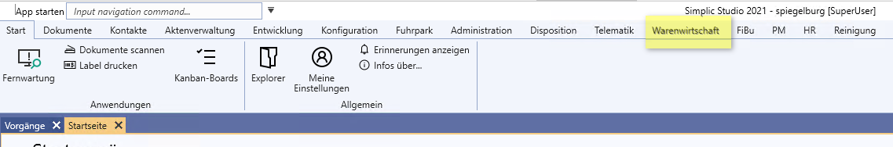

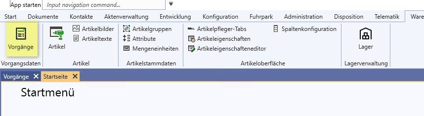

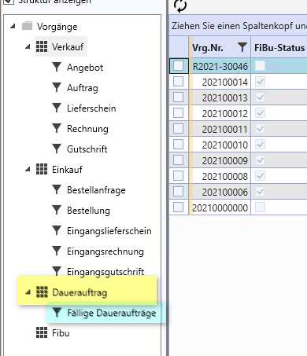

## Auswahl "Dauerauftrag"

### Neuen Dauerauftrag anlegen / bestehenden bearbeiten
Sie wählen auf der rechten Seite in der Tabelle mit der rechten Maustaste im Menu den Punkt "Neuer Vorgang".

Entsprechend können Sie auch einen bestehenden Vorgang bearbeiten welcher dort angezeigt wird.

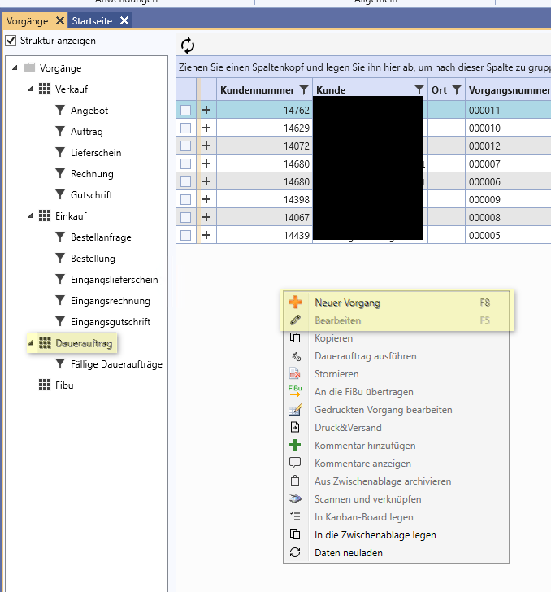

Es öffnet sich das Vorgangsfenster.

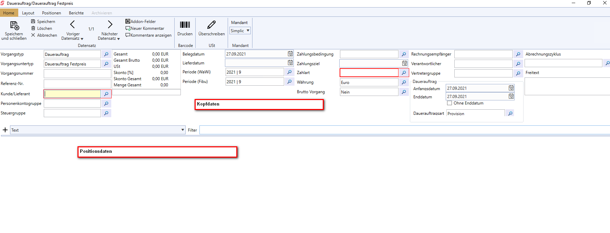

Der obere Teil des Fensters stellt die Kopfdaten eines jeden Vorganges dar, der unterer die Positionsdaten.

### Kopfteil

In den Kopfdaten tragen Sie den Kunden (für Ausgangsbelege) / Lieferanten (für Eingangsbelege) mit seinen Konditionen ein. 
*	Kundennummer, Personenkontogruppe und Steuergruppe
*	Belegdatum, Lieferdatum und Periode
*	Zahlungsbedingung

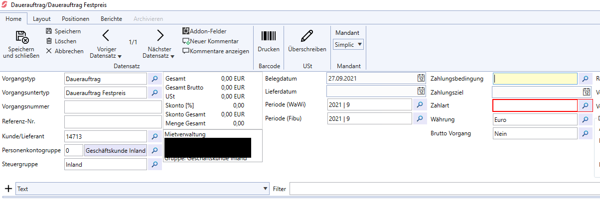

Im oberen linken Bereich tragen Sie wie folgt für den 
Dauerauftrag ein.

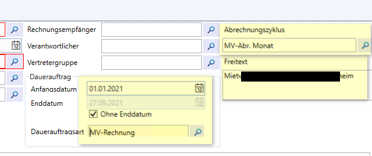

*	Dauerauftrag / Anfangsdatum und Enddatum bzw. Ohne Enddatum:
Hiermit legen Sie die Rahmenbedingung für die Berechnung des Dauerauftrags fest.
    * Wann soll er das erste Mal ausgelöst werden
    * Wann soll er das letzte Mal ausgelöst werden, oder hat er kein Enddatum.
    * Um welche Dauerauftragsart handelt es sich.
Diese Dauerauftragsart steuert, welche Art von Beleg erstellt wird.
> *	Abrechnungszyklus:
Hier wählen Sie den Abrechnungstext für den Belegdruck
> *	Freitext:
    Hier legen Sie das Verwaltetet Objekt auf dem Beleg fest.

### Positionsteil

In den Positionsteil werden die Belegpositionen eingefügt.
Sie erscheinen auf den belegen in der Reihenfolge ihrer Eingabe.
Zur Auswahl des Positionstyps klappen Sie das Menu neben dem + mit dem Pfeil herunter.

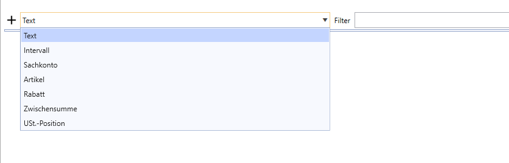

Sie können aus einer der vorhandenen Typen wählen.
Diese können sich, je nach Einrichtung von Ihrer Installation unterscheiden.
Hier die wichtigsten Typen:
-	Artikel
Hier bebuchen Sie einen Artikel mit Artikelnummer und Artikeleigenschaften.
-	Sachkonto
Hier bebuchen Sie direkt ein Sachkonto
-	Text
Ein freier Text
-	Rabatt
Diese Rabattzeile rabattiert alle Positionen oberhalb der Rabattposition
-	Intervall
Der Intervalltyp legt die Konditionen für die Positionen oberhalb des Intervalltyps fest

> Die Auswahl und der Aufbau der einzelnen Positionsfelder kann sich bei Ihrer Installation unterscheiden.

So Sie einen Typ ausgewählt haben, wählen Sie das + und die Position wird unterhalb ihrer aktuellen Position eingefügt.

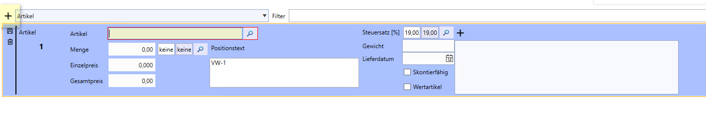

### Beispiel: Artikel

Die Position befindet sich im Bearbeitungsmodus und Sie können Daten eingeben. Für den Artikeltyp ist jeweils der Artikel, die Menge mit Einheit und der Preis einzugeben.
Der Positionstext wird hier mit der Artikelnummer vorbelegt. Für einen Dauerauftrag ist er entsprechend anzupassen. 
Für das Abspeichern der Position muss die kleine Diskette am linken Rand ausgewählt werden. Es erscheint an ihrer Stelle dann ein kleiner Stift. Sie haben den Bearbeitungsmodus verlassen. Zum Löschen der Position kann der kleine Mülleimer verwendet werden. 

Sie erkennen jetzt auch schon, ob die richtigen Konten bebucht werden und ob die Steuer stimmt.

### Intervall:
Um einem Dauerauftrag das korrekte Intervall zuzuweisen muss als nächstes eine Intervallposition gewählt werden.
Diese bezieht sich auf alle Positionen oberhalb bis zur nächsten Intervallposition.

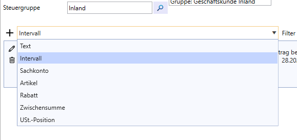

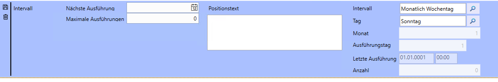

Hier ist es wichtig, dass der richtige Intervalltyp mit dem richtigen Parameter gewählt wird.
Es steht zur Auswahl:
| Interval | Feld | Auswählbarer Wert |
| :---| :---:| ---:|
| Monatlich Nummer | Ausf.Tag | Den Tag des Monats |
| Monatlich Wochentag | Tag	| Den ersten Wochentag im Monat |
| Quartal | Ausf.Tag | Den ersten Tag im Monat des Quartals  Beispiel: 3 = 3.1., 3.4., 3.7. und 3.10.| 	
| Halbjährlich | Monat  | Hier wird der Starttag des halben Jahres gewählt und entsprechend der erste Tag des Monats  Beispiel: Monat = 2 / Ausf.Tag = 5  wird 5.2. und 5.7. | 

Sie können hier auch festlegen, wann der nächste Ausführungstermin sein soll oder ob eine maximale Anzahl an Ausführungen festgelegt werden soll. 

So alles fertig eingeben wurde, speichern Sie den Beleg oben links mit Speichern und schließen.

Nach dem Speichern sollte unser Beispieldauerauftrag jetzt wie folgt aussehen:

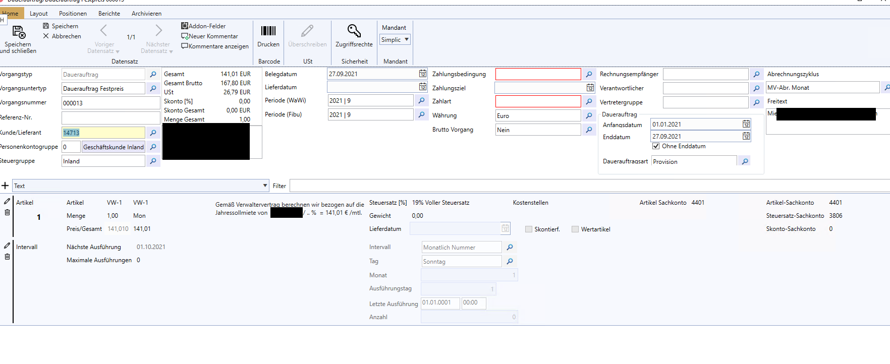

### Fällige Daueraufträge

SIMPLIC errechnet bereits beim Speichern wann das nächste Ausführungsdatum des Dauerauftrages sein wird.
Um herauszufinden, welche Daueraufträge aktuell fällig sind, muss eine Prüfung ausgelöst werden.
Dieses geschieht manuell in der Ansicht Fällige Daueraufträge:

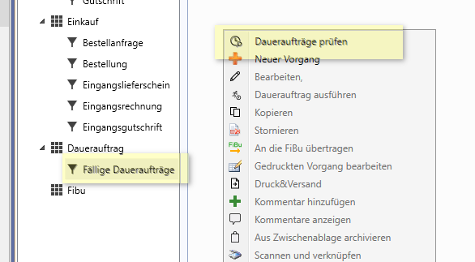

Es kann aber auch ein täglicher Automatismus eingerichtet werden, welcher zu einer festgelegten Zeit diese Aufgabe übernimmt.
Die ermittelten fälligen Daueraufträge erscheinen dann in der Liste.

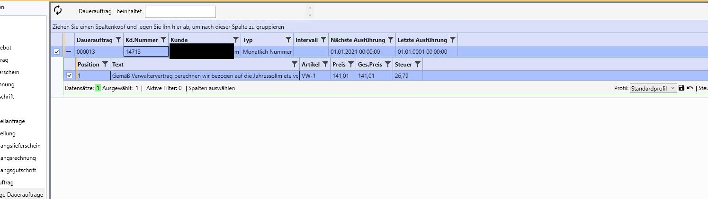

Um die fälligen Daueraufträge auszuführen, markieren Sie diese und wählen mit der rechten Maustaste die Option Dauerauftrag ausführen.

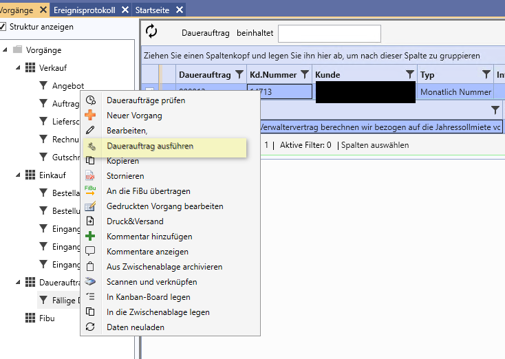

Es öffnet sich ein kleines Fenster 

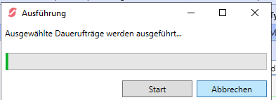 

Hier wählen Sie Start. 

Es sollte die Meldung 

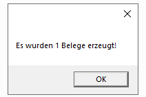 

erscheinen. Diese bestätigen Sie.

Das Fenster 

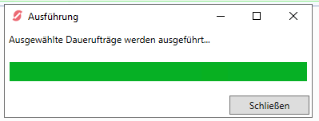 

muss noch geschlossen werden.

Die ausgewählten Einträge sind aus Fäälige Daueraufträge verschwunden. Sie nicht nicht mehr fällig.
In der Ansicht der Daueraufträge können Sie jetzt erkennen, dass ein neuer Beleg erzeugt wurde:

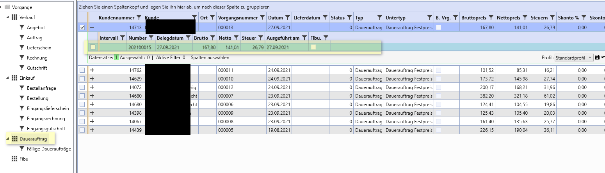 

## Weitere Bearbeitung
In unserem Beispiel haben wir eine Ausgangsrechnung erstellt.
Diese ist in den Vorgängen / Verkauf / Rechnung zu finden und zu bearbeiten.

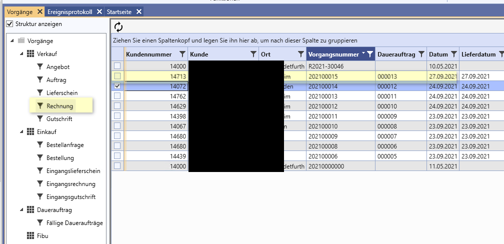 

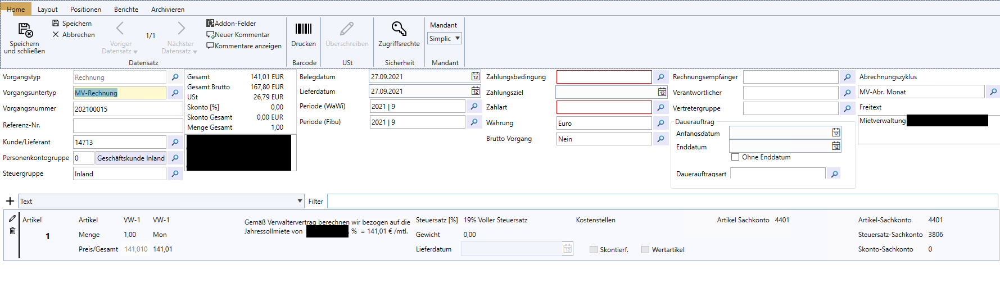 
